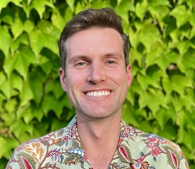
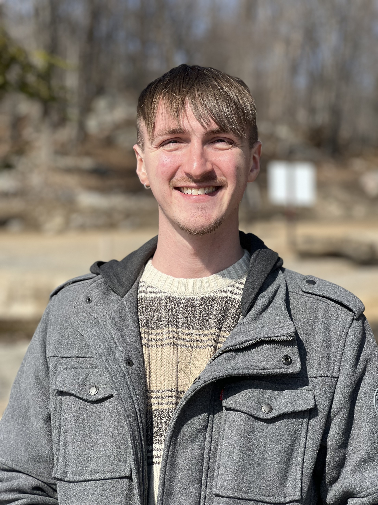

## Principal Investigator

### Dr. Charlie Nagle

{width=200px}

**Position**: Associate Professor  
**Email**: speechlearninglab@austin.utexas.edu

I study how people learn and use speech sounds, and how listeners perceive and evaluate spoken language. My research explores the mental processes that support learning new speech categories—such as when acquiring a second language—and how different types of training can make that learning more effective. I am also interested in how bilingualism and language learning contribute to long-term changes in the sound patterns of languages. To address these questions, I often use longitudinal data to track learning over time and apply advanced statistical methods to understand patterns of change and variation.

---

## Graduate Students

### Shelby Bruun

{width=200px}

**Program**: PhD, Iberian and Latin American Linguistics, Year 4 
**Research**: My research focuses on speech sound perception and production and investigates how individual differences in auditory and cognitive processing shape learners’ baseline pronunciation patterns and L2 learning trajectories. My dissertation uses a modified high-variability phonetic training approach that retrains L1 perceptual strategies to accelerate subsequent L2 learning. I am trained as a Spanish linguist and work actively with Spanish, but I also regularly conduct research in other languages that lend themselves well to addressing broader theoretical questions about language learning.

### Declan Revenew

{width=200px}

**Program**: PhD, Iberian and Latin American Linguistics, Year 2 
**Research**: My main research interests include speech production and perception of Spanish learners and how L2 speakers make themselves be understood (intelligibility). I am also drawn to teaching pedagogy and learning outcomes, particularly in relation to accent/dialect formation among L2 learners and their attitudes towards pronunciation enrichment. Lastly, I am interested in Hispanic presence in the United States.

### Louis Gehrke

{width=200px}

**Program**: PhD, Iberian and Latin American Linguistics, Year 1 
**Research**: My research focuses on how phonetic systems interact across languages in bilinguals. I am also interested in second-language pronunciation learning and instruction.

### Dana Sola

{width=200px}

**Program**: PhD, Iberian and Latin American Linguistics, Year 1 
**Research**: My research interests focus on pronunciation and speech in bilingual contexts. I am particularly interested in understanding how bilingualism shapes the phonetic systems between languages, including backward transfer, frequency and patterns of code-switching, and how these can influence speech production.

---

## Current Undergraduate Researchers

**Lucien Dans** - International Relations and Global Studies 
**Daniela del Nogal** - Speech, Language, and Hearing Sciences 
**Makai Moore** - Linguistics